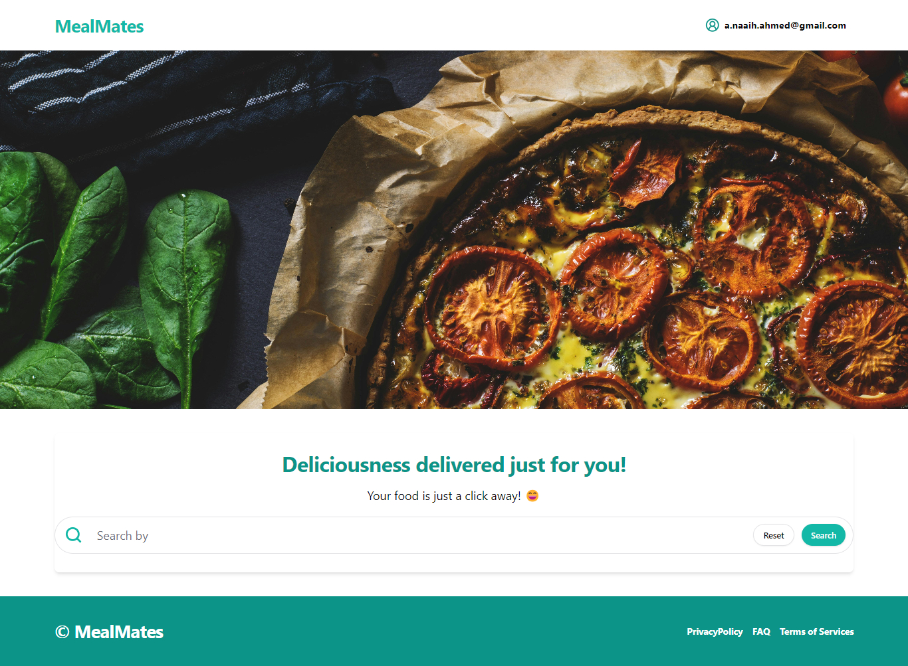

# Digital Systems Project Prototype

## MealMates - A Food Ordering Application

## Front-end:
cd frontend, then run `npm install` to install all the packages

## back-end:
cd backend, then run `npm install` to install all the packages.

## to run:
cd into frontend, `npm run dev`. then cd backend and run `npm run dev`.
